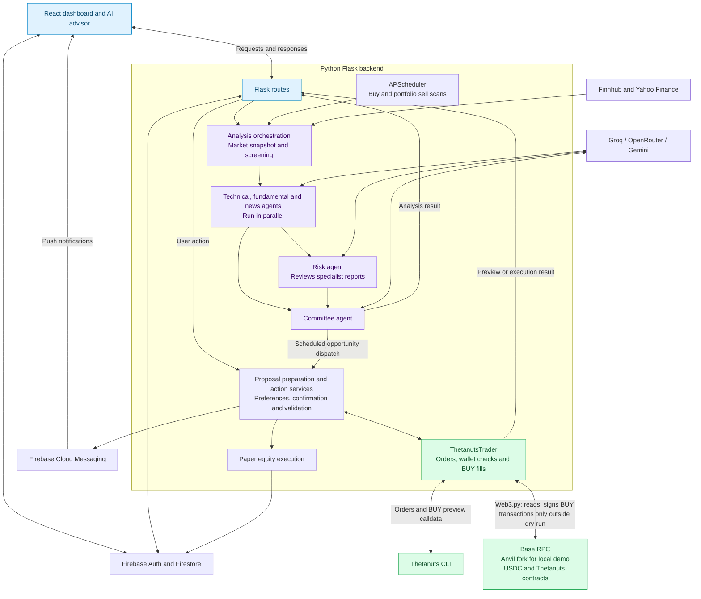

# AmanahAI


AmanahAI is an AI-assisted investment and portfolio management application that brings market research, personalised risk preferences, and blockchain options workflows into one dashboard.

**Explore markets. Understand the reasoning. Review the action.**

## Navigation

| Explore the project | Set up and run |
| --- | --- |
| [Description](#description) | [Prerequisites](#prerequisites) |
| [Demo](#demo) | [Install Dependencies](#1-install-javascript-dependencies) |
| [Key Features](#key-features) | [Configure Firebase](#3-configure-firebase) |
| [Architecture](#architecture) | [Fund the Demo Wallet](#c-add-10000-local-usdc) |
| [Problem Statement](#problem-statement) | [Setup and Installation](#setup-and-installation) |
| [Blockchain Technology](#blockchain-technology-used) | [Anvil and Virtual Funds](#set-up-anvil-and-virtual-funds-windows-git-bash) |
| [Contract Addresses](#smart-contract-addresses-local-fork--testnet) | [Start the Application](#6-start-the-application) |
| [Project Structure](#project-structure) | [Development Checks](#7-development-checks) |
| [Team Members](#team-members) | [Configuration: Backend](#4-configure-the-backend) · [Frontend](#5-configure-the-frontend) |

<details>
<summary><strong>Step-by-step setup links</strong></summary>

1. [Install JavaScript dependencies](#1-install-javascript-dependencies)
2. [Create a Python environment](#2-create-a-python-environment)
3. [Configure Firebase](#3-configure-firebase)
4. [Configure the backend](#4-configure-the-backend)
5. [Set up Anvil and virtual funds](#set-up-anvil-and-virtual-funds-windows-git-bash)
   - [Install Foundry](#a-install-foundry)
   - [Start a Base mainnet fork](#b-start-a-base-mainnet-fork)
   - [Add 10,000 local USDC](#c-add-10000-local-usdc)
   - [Connect the funded account](#d-connect-amanahai-to-the-funded-account)
6. [Configure the frontend](#5-configure-the-frontend)
7. [Start the application](#6-start-the-application)
8. [Run development checks](#7-development-checks)

</details>

---

## Description

The application combines a React frontend with a Python Flask backend. Specialist AI agents analyse technical indicators, company fundamentals, news, and risk, then combine their findings into investment recommendations. Users can explore stocks, manage a paper portfolio, review opportunities, and choose how recommendations are handled.

## Demo

Follow this walkthrough after [starting the application](#6-start-the-application):

| Screen | What to explore |
| --- | --- |
| **Investment dashboard** | Review opportunities and your portfolio alongside saved risk preferences. |
| **AI advisor** | Ask about an asset and inspect the analysis behind a recommendation. |
| **Wallet and transaction preview** | Check local ETH/USDC balances and preview a supported BTC or ETH option proposal with `FORCE_DRY_RUN=true`. |

*Dashboard, AI analysis, and wallet preview screenshots are pending capture.*

<!-- Add real application captures here when available. Keep private keys, API credentials, and personal account information out of screenshots. -->

[Back to navigation](#navigation)

## Key Features

- Email/password and Google sign-in through Firebase Authentication.
- Investment preferences, risk settings, and portfolio tracking.
- Market quotes, historical charts, and news using Finnhub and Yahoo Finance data.
- An AI advisor backed by specialist agents and a committee agent.
- Scheduled scans for buy opportunities and portfolio-aware sell recommendations.
- Paper execution for equities and ETFs, with Thetanuts options integration for BTC and ETH.
- Manual, alert-only, confirmation-based, and automated recommendation modes.
- In-app notifications and optional Firebase push notifications.
- Blockchain wallet balance checks, transaction previews, and transaction history.

[Back to navigation](#navigation)

## Problem Statement

Retail investors often need to move between separate tools to research assets, interpret news, assess risk, track their portfolios, and act on investment opportunities. This fragmented process makes it difficult to turn market information into consistent decisions that reflect an investor's preferences.

Blockchain options introduce additional steps: selecting a suitable contract, checking collateral and gas balances, approving token spending, and confirming execution. These steps can be difficult to connect with the research that motivated the trade.

AmanahAI addresses this by bringing research, portfolio context, risk-aware recommendations, and supported execution workflows together. It helps users review the reasoning behind opportunities and choose their preferred level of involvement before taking action.

[Back to navigation](#navigation)

## Architecture

The React interface sends requests to Flask. Backend services coordinate market data, AI analysis, user preferences, and trade execution. The diagram below shows the main analysis and option BUY flow; supported RFQ position closes follow a separate CLI path described below.



Implementation details:

- **AI sequence:** technical, fundamental, and news reports run in parallel. The risk agent reviews those reports, then the committee combines all four. AI output is passed to application services; the agents do not sign transactions.
- **Action modes:** manual and alert-only modes do not automatically execute. Confirmation mode waits for user approval; automated mode can dispatch a prepared proposal without a user click. Unsupported assets remain recommendation-only.
- **Option BUY:** the CLI supplies orders and fresh preview calldata. With dry-run disabled, `ThetanutsTrader` uses Web3.py to validate the chain and balances, approve USDC when necessary, submit the fill, and check receipts. Responses return through Flask to React.
- **Option SELL:** only supported RFQ positions can be closed. `close_rfq_position()` delegates to the CLI's `position close` command; it does not use the BUY signing path. OptionBook exits are not implemented by this close flow.
- **State and notifications:** Firebase handles authentication, Firestore stores application data, and Cloud Messaging delivers optional push notifications. The backend also records fill attempts in a local JSONL log.
- **Local fork:** the backend RPC is `http://127.0.0.1:8545` for the demo. CLI subprocesses inherit the environment, but the wrapper does not pass an explicit RPC flag; the CLI's effective network configuration must also be checked for local-fork execution.

[Back to navigation](#navigation)

## Blockchain Technology Used

| Technology | Use in this project |
| --- | --- |
| Base / EVM | The current live transaction implementation targets Base mainnet, chain ID `8453`. |
| Thetanuts Finance | The backend invokes `@thetanuts-finance/cli` to retrieve OptionBook orders and generate transaction previews and fill calldata. The root package also includes the Thetanuts client library. |
| USDC (ERC-20) | Used for option collateral and token allowance checks. |
| ETH | Used to pay transaction gas. |
| Web3.py and eth-account | Read balances and allowances, sign transactions, submit them, and check receipts. |
| ethers.js | Included among the root JavaScript dependencies for EVM integration. |

The backend uses a configured server-side wallet through `WALLET_PRIVATE_KEY`. Options are selected using the underlying asset, option type, strike(s), and expiry. Live fills check the chain, available collateral, gas, token allowance, and transaction receipts.

Equity trades are paper trades stored by the application. They are not on-chain equity purchases. Unsupported crypto assets remain recommendation-only.

### Smart Contract Addresses (Local Fork / Testnet)

The demo uses a local fork of Base mainnet. These are fork-based testing details, not public testnet deployments.

- **USDC (Base Mainnet Fork):** `0x833589fCD6eDb6E08f4c7C32D4f71b54bdA02913`
- **Thetanuts Contracts:** Automatically resolved via `@thetanuts-finance/cli` on Base. The backend obtains the OptionBook transaction destination from the CLI preview.
- **Demo Trading Wallet:** `0xf39Fd6e51aad88F6F4ce6aB8827279cffFb92266` (Anvil Account #0). This is a wallet address, not a smart contract address.

The local fork must use chain ID `8453` to match the backend's live fill validation. Configure the backend RPC to point to the local fork. The Anvil demo account is for local testing only; its default private key is publicly known.

[Back to navigation](#navigation)

## Setup and Installation

### Prerequisites

- Python 3.10 or newer (the source uses Python 3.10 union type syntax).
- Node.js 22.12 or newer and npm, matching the frontend's recorded Vite engine requirement.
- A Firebase project with Authentication and Cloud Firestore configured.
- A Finnhub API key for market data.
- At least one AI provider key: Groq, OpenRouter, or Gemini.
- For blockchain features: a compatible RPC endpoint and a dedicated development wallet.

### 1. Install JavaScript dependencies

Open a terminal in the repository root:

```sh
npm ci
cd frontend
npm ci
cd ..
```

The backend invokes the Thetanuts CLI through `npx`, so Node.js and npm must also be available to the backend process. The CLI may require a download on first use.

### 2. Create a Python environment

From the repository root:

```sh
python -m venv venv
```

Activate it on Windows PowerShell:

```powershell
.\venv\Scripts\Activate.ps1
```

Or on macOS/Linux:

```sh
source venv/bin/activate
```

Install the packages used by the backend:

```sh
python -m pip install --upgrade pip
python -m pip install Flask flask-cors Flask-Limiter python-dotenv firebase-admin requests yfinance aiohttp httpx web3 eth-account "APScheduler>=3,<4" tzdata
```

The repository does not currently include a Python requirements or lock file. This dependency list is derived from the source imports; it is not a pinned, reproducible Python environment.

### 3. Configure Firebase

1. Register a web application in your Firebase project.
2. Enable Email/Password and Google sign-in, and authorise the local development domain, such as `localhost`.
3. Create a Cloud Firestore database and configure rules that allow authenticated users to access their own application data.
4. Download a Firebase Admin service account JSON file and save it as `backend/firebase-adminsdk.json`. The backend requires this exact path at startup.
5. For push notifications, configure Firebase Cloud Messaging and obtain a web push VAPID public key.

Use the same Firebase project for the frontend configuration and backend service account. Keep the service account file and private credentials out of version control; the repository already ignores the service account path and `.env` files.

### 4. Configure the backend

Create `backend/.env`:

```dotenv
PORT=5000
FINNHUB_API_KEY=your_finnhub_api_key

# Configure at least one provider. Leave unused providers empty.
GROQ_API_KEY=your_groq_api_key
OPENROUTER_API_KEY=
GEMINI_API_KEY=

# Keep blockchain submissions in preview mode during development.
FORCE_DRY_RUN=true

# Optional wallet features; use a dedicated development wallet.
WALLET_PRIVATE_KEY=
BASE_RPC_URL=http://127.0.0.1:8545

OPPORTUNITY_SCAN_INTERVAL_MINUTES=30
TOP_N_OPPORTUNITIES=5
PAPER_CASH_USD=10000
PAPER_PORTFOLIO_VALUE_USD=10000
```

The local RPC URL assumes that a compatible local node or Base fork is already running; follow the Git Bash instructions below to start one. Wallet features are disabled when the private key is empty. Dry-run mode prevents blockchain transaction submission but can still require network access for quotes and previews. It is not a testnet deployment.

[Back to navigation](#navigation)

### Set up Anvil and virtual funds (Windows Git Bash)

Use **Git Bash** for the commands in this section. The ETH and USDC created here exist only on your local fork and have no real monetary value.

#### A. Install Foundry

Run the official Foundry installer, then add its binaries to the current terminal's path:

```bash
curl -L https://foundry.paradigm.xyz | bash
export PATH="$HOME/.foundry/bin:$PATH"
foundryup
anvil --version
cast --version
```

If a new terminal cannot find `anvil` or `cast`, run the `export PATH` command there too. See the [Foundry installation guide](https://getfoundry.sh/getting-started/installation).

#### B. Start a Base mainnet fork

In the first Git Bash terminal, replace the placeholder with a Base mainnet RPC endpoint from your provider:

```bash
export BASE_FORK_SOURCE_URL="https://YOUR_BASE_MAINNET_RPC_ENDPOINT"
anvil --fork-url "$BASE_FORK_SOURCE_URL" --chain-id 8453 --host 127.0.0.1 --port 8545 --balance 10000
```

Keep this terminal running. The upstream endpoint supplies Base state; the app will connect to `http://127.0.0.1:8545`. Chain ID `8453` matches the backend's validation. A plain `anvil` command without `--fork-url` does not load Base's USDC or Thetanuts contracts.

Anvil prints its development accounts and their private keys. Account #0 is `0xf39Fd6e51aad88F6F4ce6aB8827279cffFb92266` with the default mnemonic. The command funds each development account with 10,000 local ETH. See [Anvil's account and forking documentation](https://www.getfoundry.sh/anvil/index.html).

#### C. Add 10,000 local USDC

<details>
<summary><strong>Click to expand: Commands to mint 10,000 local USDC</strong></summary>

In a **second Git Bash terminal**, define the local RPC and addresses:

```bash
export PATH="$HOME/.foundry/bin:$PATH"
LOCAL_RPC_URL="http://127.0.0.1:8545"
DEMO_WALLET="0xf39Fd6e51aad88F6F4ce6aB8827279cffFb92266"
USDC_ADDRESS="0x833589fCD6eDb6E08f4c7C32D4f71b54bdA02913"

cast chain-id --rpc-url "$LOCAL_RPC_URL"
cast balance "$DEMO_WALLET" --ether --rpc-url "$LOCAL_RPC_URL"
cast call "$USDC_ADDRESS" "decimals()(uint8)" --rpc-url "$LOCAL_RPC_URL"
```

Expect chain ID `8453`, approximately `10000` ETH on a fresh fork, and `6` USDC decimals. Stop if these checks fail; confirm that Anvil is running and the upstream RPC serves Base mainnet state.

The following commands use Anvil's local account impersonation to configure the demo wallet as a minter, then mint 10,000 USDC. This uses the token's `masterMinter`, `configureMinter`, and `mint` interfaces from [Circle's contract source](https://github.com/circlefin/stablecoin-evm/blob/master/contracts/v1/FiatTokenV1.sol). It changes only the local fork; keep every command pointed at the loopback RPC shown above.

```bash
# Read the authority from the fork instead of hardcoding its address.
USDC_MASTER_MINTER=$(cast call "$USDC_ADDRESS" "masterMinter()(address)" --rpc-url "$LOCAL_RPC_URL")

# Allow this authority to send a transaction on the local Anvil node.
cast rpc anvil_impersonateAccount "$USDC_MASTER_MINTER" --rpc-url "$LOCAL_RPC_URL"
cast rpc anvil_setBalance "$USDC_MASTER_MINTER" 0xDE0B6B3A7640000 --rpc-url "$LOCAL_RPC_URL"

# USDC uses 6 decimals: 10000 * 1000000 = 10000000000 raw units.
cast send "$USDC_ADDRESS" "configureMinter(address,uint256)" "$DEMO_WALLET" 10000000000 --from "$USDC_MASTER_MINTER" --unlocked --rpc-url "$LOCAL_RPC_URL"
cast rpc anvil_stopImpersonatingAccount "$USDC_MASTER_MINTER" --rpc-url "$LOCAL_RPC_URL"

# Anvil's default demo account is already unlocked.
cast send "$USDC_ADDRESS" "mint(address,uint256)" "$DEMO_WALLET" 10000000000 --from "$DEMO_WALLET" --unlocked --rpc-url "$LOCAL_RPC_URL"

# Verify the result.
cast call "$USDC_ADDRESS" "balanceOf(address)(uint256)" "$DEMO_WALLET" --rpc-url "$LOCAL_RPC_URL"
cast balance "$DEMO_WALLET" --ether --rpc-url "$LOCAL_RPC_URL"
```

On a fresh fork, the USDC balance should be `10000000000` raw units, equivalent to **10,000 USDC**. Running the minting sequence again adds another 10,000 USDC. If a transaction reverts, stop and inspect the error; this procedure assumes the forked token exposes these interfaces and is not paused.

</details>

#### D. Connect AmanahAI to the funded account

Update these entries in `backend/.env`, copying the private key for **Account #0** from your Anvil terminal:

```dotenv
BASE_RPC_URL=http://127.0.0.1:8545
WALLET_PRIVATE_KEY=replace_with_anvil_account_0_private_key
FORCE_DRY_RUN=true
```

Restart the backend after editing `.env`, then check the wallet balance in the application. Keep Anvil running alongside the backend and frontend. To activate the Python environment from Git Bash, run `source venv/Scripts/activate` from the repository root.

`FORCE_DRY_RUN=true` keeps option fills in preview mode. To test actual transaction submission **on this local fork**, set it to `false` only while `BASE_RPC_URL` points to your local Anvil node, then restart the backend. Thetanuts quotes and previews may still depend on external services; funding the wallet alone does not guarantee an available or executable option order.

Stopping Anvil and starting a fresh instance resets the local funding and transactions, so repeat the funding steps after a reset. Do not send real funds to Anvil's publicly known development accounts.

[Back to navigation](#navigation)

### 5. Configure the frontend

Create `frontend/.env` using your Firebase web application settings:

```dotenv
VITE_FIREBASE_API_KEY=your_firebase_web_api_key
VITE_FIREBASE_AUTH_DOMAIN=your_project.firebaseapp.com
VITE_FIREBASE_PROJECT_ID=your_project_id
VITE_FIREBASE_STORAGE_BUCKET=your_storage_bucket
VITE_FIREBASE_MESSAGING_SENDER_ID=your_messaging_sender_id
VITE_FIREBASE_APP_ID=your_web_app_id
VITE_FIREBASE_MEASUREMENT_ID=your_measurement_id

# Optional: required for browser push notifications.
VITE_FIREBASE_VAPID_KEY=your_web_push_public_key

VITE_BACKEND_URL=http://localhost:5000
VITE_API_BASE_URL=http://127.0.0.1:5000/api
```

Several frontend pages still hardcode backend URLs on port `5000`. Keep that port for local development; changing only these environment variables does not update every API call. Values prefixed with `VITE_` are exposed to the browser, so never place wallet private keys or service account credentials there.

### 6. Start the application

In the first terminal, with the Python environment active:

```sh
cd backend
python app.py
```

In a second terminal, starting from the repository root:

```sh
cd frontend
npm run dev
```

Open the frontend URL printed by Vite, normally `http://localhost:5173`. Check the backend at `http://localhost:5000/api/health`. Sign up, complete your investment preferences, and open the dashboard.

Starting `app.py` also starts the background opportunity scanner, which uses the configured market data and AI services.

### 7. Development checks

Run the existing execution routing tests from the repository root:

```sh
cd backend
python -m unittest discover -s tests
```

Build or lint the frontend from its directory:

```sh
npm run build
npm run lint
```

The frontend build output is written to `frontend/dist`. These commands do not deploy the application or any smart contracts.

[Back to navigation](#navigation)

## Project Structure

```text
AmanahAI/
|-- backend/
|   |-- agents/              # Specialist AI agents and orchestration
|   |-- investment/          # Screening, ranking, and scheduled scans
|   |-- services/            # Portfolio, execution, and notification services
|   |-- trading/             # Contract selection and validation
|   |-- tests/               # Execution routing tests
|   |-- app.py               # Flask entry point
|   `-- thetanuts_trader.py   # Blockchain wallet and options integration
|-- frontend/
|   |-- public/              # Static assets and messaging service worker
|   |-- src/                 # React pages, components, and services
|   `-- package.json
|-- package.json             # Shared JavaScript dependencies
`-- README.md
```

[Back to navigation](#navigation)

## Team Members

- Goh Pei Jia
- Coshin Lee
- Ryan

[Back to navigation](#navigation)
